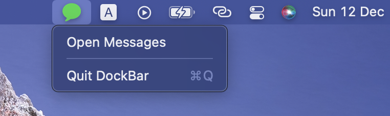
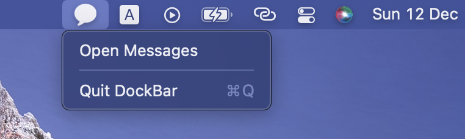

# DockBar

DockBar is just a simple app that show messages icon on your status bar when you have unread messages.
This app is very useful for people who hides their macos dock and doesn't want to forget that they got unread messages.

   
   

## Installation
You can download the lastest dmg from [Release Page](https://github.com/61130061/DockBar/releases)

## Usage
1. Open DockBar app
2. Look at your status bar! The message icon will turn green when you have unread messages.

## TODO List
- [x] Hide dock icon
- [x] Open Messages app via menu bar
- [ ] Check update
- [ ] User can set how often to check new messages
- [ ] User can set the color of their icon
- [ ] Test on Apple Silicon chip
